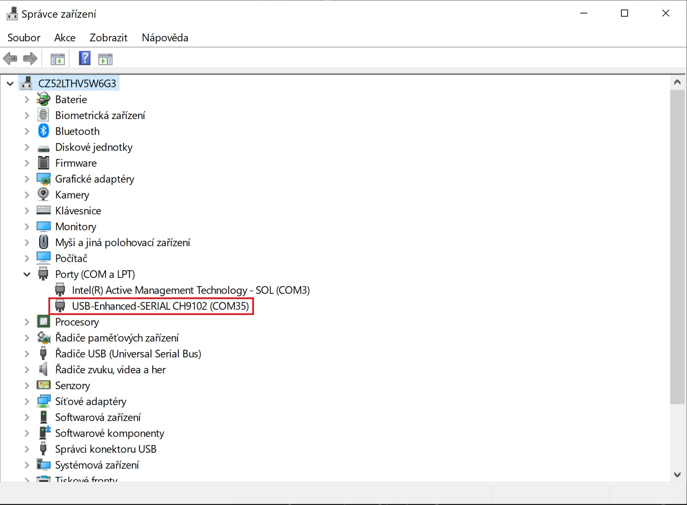
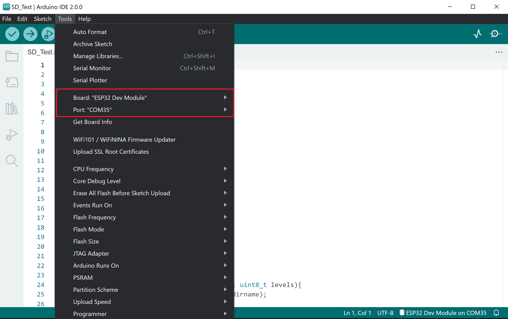

# How to make display work - Windows

1. Download [CH343SER.EXE](http://www.wch-ic.com/search?t=all&q=CH9102) and install it.

2. Connect display to your PC and turn it on with button on the side of the device (**single press to turn on, long press to turn off**).

3. Open Device Manager (Start → Control Panel → Hardware and Sound → Device Manager) and find COM port number.

    

## Arduino IDE
1. Download Github repository and look for project you want to try in [SW](../SW) folder.
2. Open example with Arduino IDE and set appropriate COM port and board type.
   
    

3. Download necessary libraries.
4. Upload the code.
## Platform IO
1. Download Github repository and look for project you want to try in [SW](https://github.com/LaskaKit/ESPD-35/tree/main/SW) folder.
2. Open example with Platform IO. COM port should be set automaticaly.
3. Libraries will be downloaded automatically, because of lib_deps in platformio.ini.
4. Upload the code.

# How to make display work - Mac

1. Download [CH341SER_MAC.ZIP](https://www.wch-ic.com/search?t=all&q=CH9102) and unzip it
2. Run **CH34xVCPDriver.pkg** and follow the install instruction, reboot the Mac
3. Connect display to your Mac and turn it on with button on the side of the device

## Arduino IDE
1. Download Github repository and look for the project you want to try in [SW](../SW) folder.
2. Open example with Arduino IDE and set the appropriate serial port (/dev/cu.wuchsbserial) and board type.
   

   
4. Download necessary libraries.
5. Upload the code.
