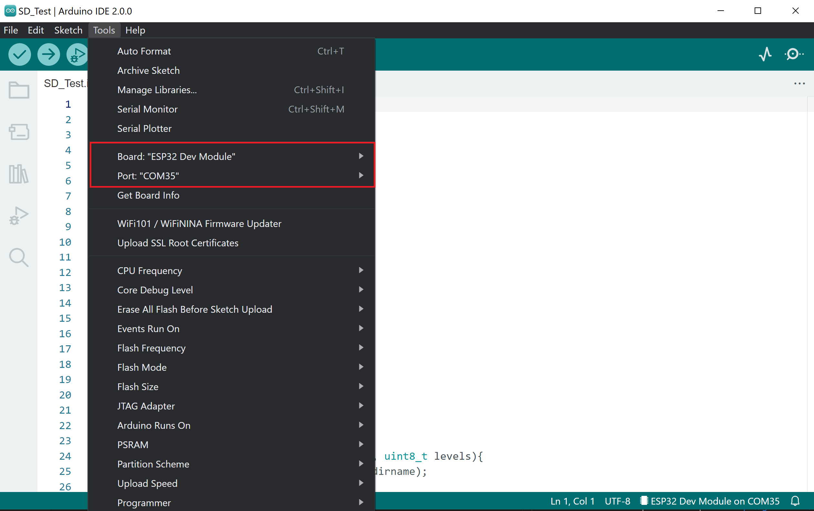

# Jak pracovat s displejem

1. Stáhnout [CH343SER.EXE](http://www.wch-ic.com/search?t=all&q=CH9102) a nainstalovat. Návod i na našem [blogu](https://blog.laskakit.cz/instalace-ovladace-prevodniku-usb-na-uart-ch340/).

2. Zapojit displej do PC a zapnout tlačítkem na boku (**stisk pro zapnutí, dlouhý stisk pro vypnutí**).

3. Start – Systém – Správce zařízení (může být potřeba oprávnění správce) najít položku Porty (COM a LPT).

    

## Arduino IDE
1. Stáhnout Github repository a otevřít příklad, který chcete zkusit ze složky [SW](../SW).
2. Otevřít příklad pomocí Arduino IDE a nastavit správný COM port a typ desky.
   
    

3. Stáhnout nezbytné knihovny: [GxEPD2](https://github.com/ZinggJM/GxEPD2)
4. Nahrát kód.
## Platform IO
1. Stáhnout Github repository a otevřít příklad, který chcete zkusit ze složky [SW](../SW).
2. Otevřít příklad pomocí Arduino IDE a nastavit správný COM port a typ desky. COM port by měl být nastaven automaticky.
3. Knihovny se stáhnou automaticky díky lib_deps v souboru platformio.ini.
4. Nahrát kód.